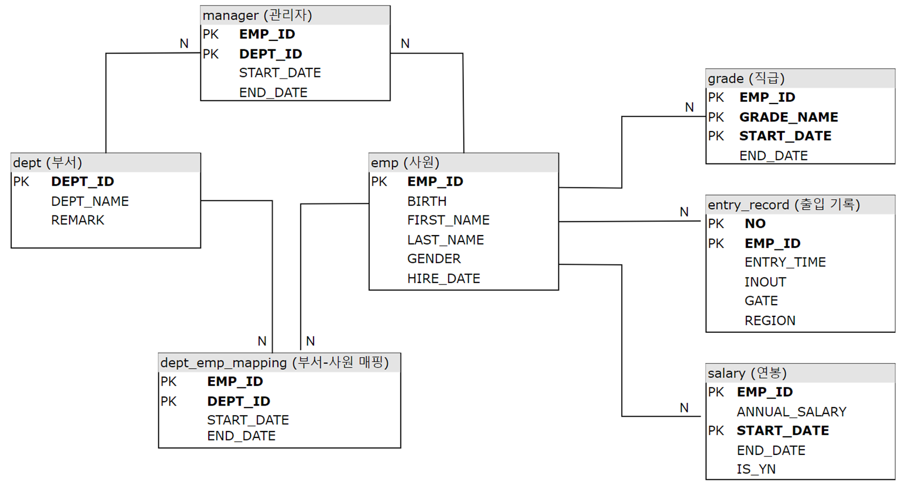

# 1장. 실습 환경 구성하기
## 강의 목차
- 실습 환경 소개
    - 전체 강의 중 현재 위치
    - 실습이 가능한 환경들
    - 강의에서 수행할 실습 환경 : Windows + MySQL
- Local PC에 MySQL 설치
- MySQL에 실습 데이터 업로드
    - 실습 데이터 다운로드 URL : https://github.com/7e7ey/Lecture-SQLtune.kit
- 실습 데이터 상세(ERD)

- [참고 강의] Local PC에 MariaDB 설치
- [참고 자료] AWS RDS에 MySQL 설치

