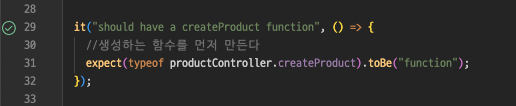

# TDD Unit test

express를 기반의 테스트 코드 작성 정리

## 기본 개념

소프트웨어 개발 프로세스에서 테스트를 먼저 작성하고, 그 테스트를 통과하는 코드를 나중에 작성하는 방법론.

## 진행 방식

큰 틀로 보자면 간단하게

- 테스트 작성
- 테스트가 통과될 코드 작성

이게 뭐야.. 간단해 보이는데, 전혀 간단하지 않았다.

## Jest

일단 기본 틀은 이렇다.

```js
describe("unit 테스트 묶음 설명", () => {
  it("unit test 1 설명", () => {
    //테스트 코드
  });

  it("unit test 2 설명", () => {
    //테스트 코드
  });

  it("unit test 3 설명", () => {
    //테스트 코드
  });
});
```

간단하게 보자면 하나의 API를 하나의 테스트 묶음으로 묶어두고, 각 항목들이 순서대로 제대로 작동하는지 확인하는 코드를 작성하는거라 생각하면 되겠다.
테스트 함수는 `it()` 혹은 `test()`로 작성한다.

---

## Create Unit Test

### 함수 정의

```js
const productController = require("../../controller/products");

describe("Product Controller Create", () => {
  it("should have a createProduct function", () => {
    //생성하는 함수를 먼저 만든다
    expect(typeof productController.createProduct).toBe("function");
  });
});
```

맨 처음 함수를 만들것이라고 정의한다.
함수의 이름은 `createProduct로` 정의하는데, `productController`를 불러와야한다.<br>
테스트는 기본적으로 `실제 작동 코드`를 사용해서 테스트를 한다.

그렇기 때문에 위 함수를 테스트 하기 위해선 함수를 정의한다.
여기서 중요한 키워드가 2개가 나오는데, `expect()`와 `toBe()` 이다.<br>
`expect - matcher`라고 하는데, matcher의 종류는 `toBe()`외에도 다양한 함수들이 있다.
https://jestjs.io/docs/expect

```js
expect(A).toBe(B);
```

> 간단하게 생각하면 된다.A는 B가 되어야만 한다. 말 그대로 `createProduct` 타입은 `"function"`이라는 결과가 나와야 한다.

### createdProduct

```js
exports.createProduct = (req, res, next) => {};
```

위 함수를 정말로 정의만 하면 된다.


---

### 데이터 입력

데이터 입력은 함수에 데이터를 입력하는 값을 직접 생성하고, 추적하는것 까지 작성해야한다.

#### 데이터 정의

몽고DB를 사용해서 스키마를 정의한다.

```js
const mongoose = require("mongoose");

const productSchema = new mongoose.Schema({
  name: {
    type: String,
    required: true,
  },
  description: {
    type: String,
    required: true,
  },
  price: {
    type: Number,
  },
});

//model 생성
const Product = mongoose.model("Product", productSchema);

module.exports = Product;
```

테스트 코드를 작성해보자

```js
it("should call ProductModel.create", () => {
  productController.createProduct(req, res, next);
  expect(productModel.create).toBeCalledWith("입력받을 값"); //create 함수에 newProduct값 _ req.body 가 들어가는지 확인
});
```

이제 함수에서 입력 받을 값을 알려줘야한다. 중요한 점은 무슨 함수를 호출하는지 알 방법이 없다는거다.<br>
그래서 `jest.fn()`이라는 Mock 함수를 생성하는 함수를 사용해서 호출할 함수를 추적하는 기능을 사용한다.

> 간단하게 정리하자면 `jest.fn()`을 사용하면 테스트 코드에서 테스트할 함수들의 상태를 추적할 수 있다.

```js
const productModel = require("../../models/Products"); //MongoDB 사용
productModel.create = jest.fn();
```

이런식으로 `productModel`에서 `create()` 함수를 추적할 수 있게 등록한다.

#### 사용할 필드를 정의

```js
let req, res, next;

const newProduct = {
  name: "Gloves",
  description: "good to wear",
  price: 15,
};

beforeEach(() => {
  req = httpMocks.createRequest();
  res = httpMocks.createResponse();
  next = jest.fn();
});
```

이부분이 중요해보였다.

> 앞으로 계속해서 사용하게 될, `request`, `response`, `next`는 모두 입력, 출력, 에러 검출 등에 사용된다. <br>

> `beforeEach()`는 각 테스트를 실행하기 전에 변수, 환경등을 설정해주는 함수로, `it()` 혹은 `test()` 단위마다 한번씩 실행된다.
> 입력, 출력을 확인할 때 사용할 `httpMocks`라이브러리를 사용해서 `request`와 `response` , `next`를 각각 만들어준다.

> newProduct는 입력하는 데이터는 앞서 정의한 데이터 모델을 기반으로 임의로 생성해준다.<br>
> 객체를 만들어서 외부 json파일로 import하는게 더 깔끔하다.

### 정리하자면

```js
//...생략
const productModel = require("../../models/Products");
const newProduct = require("../data/new-product.json"); //임의 입력 값은 외부 json 파일로 빼뒀다.

productModel.create = jest.fn();

beforeEach(() => {
  req = httpMocks.createRequest();
  res = httpMocks.createResponse();
  next = jest.fn();
});

describe("Product Controller Create", () => {
  //... 생략
  it("should call ProductModel.create", () => {
    productController.createProduct(req, res, next);
    expect(productModel.create).toBeCalledWith(newProduct); //create 함수에 newProduct값 _ req.body 가 들어가는지 확인
  });
});
```

이렇게 되면 테스크 코드는 작성이 끝난다.
두번째 테스트 코드를 간단하게 설명하자면 <br>

1. `createProduct()`를 호출하면
2. `productModel.create`가 호출될 것이다.
3. 호출 될 때는 `newProduct`가 (입력되어서) 함께 호출될 것이다 라고 정의하는것이다.

간단하게 말로 정리하면 간단해지는 것 같다.

### 검증하게 될 코드

```js
exports.createProduct = (req, res, next) => {
  productModel.create(req.body);
};
```

입력값으로는 body로 받을거기 때문에 req.body로 입력받는다.
한거에 비해 좀 진빠지긴 한다.

### 반환 값 정의

이제 함수에 데이터를 입력했으니, 어떤 값을 반환하는지 정의하자.

```js
it("should return 201 response code", async () => {
  await productController.createProduct(req, res, next);
  expect(res.statusCode).toBe(201);
  expect(res._isEndCalled()).toBeTruthy(); //send를 사용해서 전달이 완료됐는지 검증
});
```

잘 보면 검증하는 함수에 `async`가 생겼다. 데이터 입력함수를 호출 할 때 비동기로 처리하기 때문에 `async` 키워드를 붙여준다.

> `_isEndCalled()`는 express에서 호출이 완료를 정의해주는 `res.send()`, `res.end()`, `res.json()` 등이 호출되면 응답이 완료된
> 것으로 간주한다.

> `toBeTruthy()`는 조건이 "참(truthy)"인지 확인하는 메서드이다. JS에서 말하는 false, 0, ''(빈 문자열), null, undefined, NaN을 제외한 모든 값이 된다.

그러니 위 코드를 정리하자면

1. 비동기로 `createProduct()`를 호출하게 되면
2. 반환 code는 `201`이 되어야하고
3. 함수는 `send()`,`json()`, `end()` 중 하나로 함수가 종료되어야 한다.

### 검증하게 될 코드

```js
exports.createProduct = async (req, res, next) => {
  const createdProduct = await productModel.create(req.body);
  res.status(201).send();
};
```

함수가 `async`로 정의되었고, `create()`를 불러서 반환 값을 createProduct에 저장만 하고, 상태 `201`과 `send()`로 함수를 마무리한다.

### Response 반환 정의

```js
it("should return json body in response", async () => {
  productModel.create.mockReturnValue(newProduct);
  await productController.createProduct(req, res, next);
  expect(res._getJSONData()).toStrictEqual(newProduct);
});
```

이번에는 위 코드와 동일하지만, 검증하는 반환 값이 다르다.
`mockReturnValue`는 productModel.create를 사용할 때, `반환되는 값을 정의`한다.
앞서 정의한 `newProduct`를 활용해서 `_getJSONData()` 를 이용해서 json 반환 값을 받아오고. 이후 `toStrictEqual()`로 값을 비교한다.

`.toStrictEqual`은 객체가 동일한 구조와 타입을 가지는지 테스트할 때 사용됩니다.<br>

- `.toEqual`과의 차이점:<br>
  - undefined 속성을 가진 키들도 확인됩니다.
    - 예를 들어, {a: undefined, b: 2}는 {b: 2}와 같지 않습니다.
  - undefined 항목들이 고려됩니다.
    - 예를 들어, [2]는 [2, undefined]와 같지 않습니다.
  - 배열의 희소성(sparseness)이 확인됩니다.
    - 예를 들어, [, 1]은 [undefined, 1]과 같지 않습니다.
  - 객체 타입이 확인됩니다.
    - 예를 들어, 필드 a와 b를 가진 클래스 인스턴스는 필드 a와 b를 가진 리터럴 객체와 같지 않습니다.

메뉴얼에 적혀있는 내용이다. 확실히 엄격하게 검증하는 메서드인 듯 하다.

### 검증하게 될 코드

```js
exports.createProduct = async (req, res, next) => {
  const createdProduct = await productModel.create(req.body);
  res.status(201).json(createdProduct);
};
```

반환값 `send()`에서 `json()`을 사용하고 저장한 데이터를 createdProduct 변수에 담고 json 값으로 반환한다.

### 에러 정의

```js
it("should handle errors", async () => {
  const errorMessage = { message: "description property missing" };
  const rejectedPromise = Promise.reject(errorMessage);
  productModel.create.mockReturnValue(rejectedPromise);
  await productController.createProduct(req, res, next);
  expect(next).toBeCalledWith(errorMessage);
});
```

이번에는 에러가 발생했을 때를 가정하고 정의해준다.
사실 이부분이 제일 이해가 안갔는데, 천천히 돌아보면 이해가 된다.

1. errorMessage를 정의해주고, 반환될 값을 에러가 발생했다고 가정하고 작성한다.
2. 에러가 발생한다면 `reject`된 `Promise` 반환값이 나온다.
3. "임의의" 에러메시지를 만들어 주고. `reject`될 때 알려주는 메시지로 사용한다.
4. 이후 `Mock` 함수를 사용해서 반환될 값이 `rejectedPromise`라고 정의해준다.
5. 함수에서 에러가 발생했을테니, 반환 값 `res`가 아닌 `next`를 검증한다.

   - `next`는 express에서 에러가 발생했을 때 반환하는 값이다.

6. next는 반환될 때 `errorMessage`를 함께 반환할것이다.

### 검증하게 될 코드

```js
exports.createProduct = async (req, res, next) => {
  try {
    const createdProduct = await productModel.create(req.body);
    res.status(201).json(createdProduct);
  } catch (e) {
    next(e);
  }
};
```

실제 코드에서 `catch()` 항목에서 `console.log(e)`를 넣고 테스트를 실행하면 테스트 코드에서 정의한 `errorMessage`가 반환된다.

## 전체 코드

### 테스트 코드

```js
const productController = require("../../controller/products");
const productModel = require("../../models/Products");
const httpMocks = require("node-mocks-http");
const newProduct = require("../data/new-product.json");

productModel.create = jest.fn();

let req, res, next;
beforeEach(() => {
  req = httpMocks.createRequest();
  res = httpMocks.createResponse();
  next = jest.fn();
});

describe("Product Controller Create", () => {
  beforeEach(() => {
    req.body = newProduct; //req body를 생성해줌
  });

  it("should have a createProduct function", () => {
    //생성하는 함수를 먼저 만든다
    expect(typeof productController.createProduct).toBe("function");
  });

  it("should call ProductModel.create", () => {
    productController.createProduct(req, res, next);
    expect(productModel.create).toBeCalledWith(newProduct); //create 함수에 newProduct값 _ req.body 가 들어가는지 확인
  });

  it("should return 201 response code", async () => {
    await productController.createProduct(req, res, next);
    expect(res.statusCode).toBe(201);
    expect(res._isEndCalled()).toBeTruthy(); //send를 사용해서 전달이 완료됐는지 검증
  });

  it("should return json body in response", async () => {
    productModel.create.mockReturnValue(newProduct);
    await productController.createProduct(req, res, next);
    expect(res._getJSONData()).toStrictEqual(newProduct);
  });

  it("should handle errors", async () => {
    const errorMessage = { message: "description property missing" };
    const rejectedPromise = Promise.reject(errorMessage);
    productModel.create.mockReturnValue(rejectedPromise);
    await productController.createProduct(req, res, next);
    expect(next).toBeCalledWith(errorMessage);
  });
});
```

### 작동 코드

```js
exports.createProduct = async (req, res, next) => {
  try {
    const createdProduct = await productModel.create(req.body);
    res.status(201).json(createdProduct);
  } catch (e) {
    next(e);
  }
};
```

---

참조 : [Jest Docs](https://jestjs.io/docs/getting-started) <br>
코드 원본 : [따라하며 배우는 TDD 개발-John Ahn](https://www.inflearn.com/course/%EB%94%B0%EB%9D%BC%ED%95%98%EB%A9%B0-%EB%B0%B0%EC%9A%B0%EB%8A%94-tdd/dashboard)
